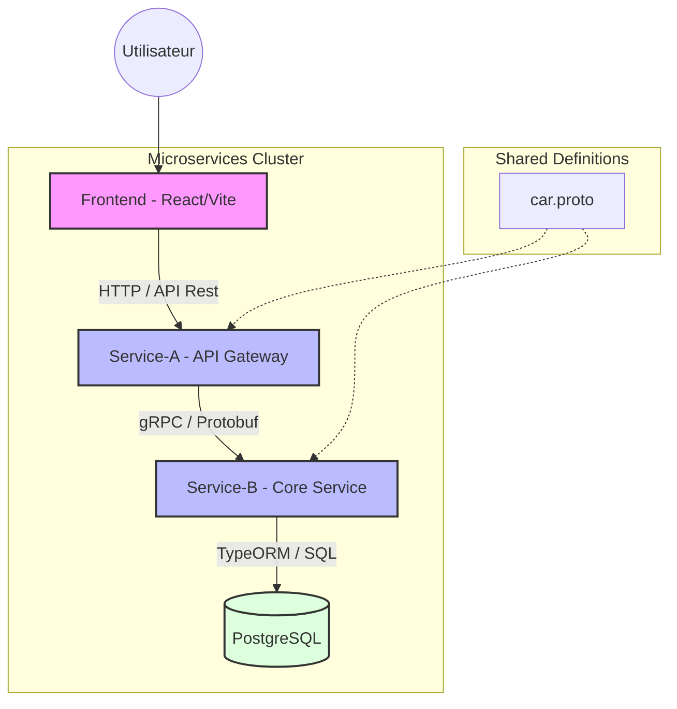
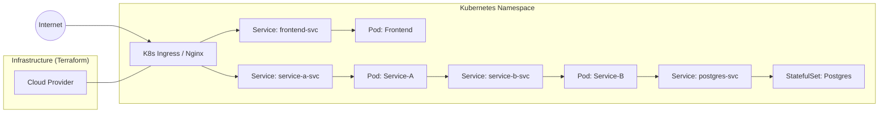

# ST2SCL Project 2025

This project is a car rental management application based on a microservices architecture. It was designed to meet the requirements of the ST2SCL 2025 project, including the use of Docker, Kubernetes, gRPC, and Terraform.

## Project Architecture

The application is composed of several components:



1. Frontend: A web application developed with React, TypeScript, and Vite. It allows users to interact with the rental system.
2. Service A (API Gateway): A NestJS service that acts as a gateway. It exposes a REST API documented with Swagger and communicates with Service B via gRPC.
3. Service B (Car Fleet): A NestJS microservice responsible for managing car data. It communicates via gRPC and uses TypeORM with a PostgreSQL database.
4. Database: A PostgreSQL instance for persistent data storage.

## Technologies Used

* Backend: NestJS, gRPC, TypeORM
* Frontend: React, TypeScript, Vite, TailwindCSS
* Database: PostgreSQL
* DevOps: Docker, Docker Compose, Kubernetes (GKE), Terraform, GitHub Actions

## Installation and Local Setup

### Prerequisites

* Docker and Docker Compose
* Node.js (for local development)

### Running with Docker Compose

To start the entire infrastructure locally, run the following command at the root of the project:

```bash
docker-compose up --build
```

Once the containers are started:
* The frontend is accessible at: http://localhost:8080
* The API Gateway (Service A) is accessible at: http://localhost:3000
* The Swagger documentation is available at: http://localhost:3000/api

## Deployment

### Kubernetes

The Kubernetes configuration files are located in the k8s directory. They allow deploying the application to a cluster. The resources include:



* Deployments for each service.
* Services for internal communication.
* An Ingress for external exposure.

### Infrastructure as Code

The terraform directory contains the necessary files to provision a Google Kubernetes Engine (GKE) cluster on Google Cloud Platform.

## CI/CD

A GitHub Actions workflow is configured in .github/workflows to automatically build and push Docker images.
