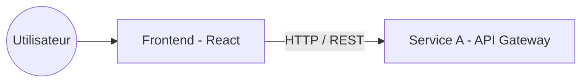

# Frontend

This application is the web client for the car rental project.



## Technologies

* React 19
* TypeScript
* Vite
* TailwindCSS

## Development

To start the frontend in development mode:

```bash
npm install
npm run dev
```

The application will be accessible by default at http://localhost:5173. It expects the API Gateway (Service A) to be available at http://localhost:3000.
