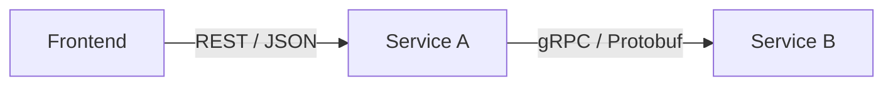

# Service A (API Gateway)

This service acts as a single entry point for the frontend. It transforms REST requests into gRPC calls to Service B.



## Features

* REST API exposure.
* Integrated Swagger documentation.
* gRPC client for communication with Service B.

## Development

To start the service in development mode:

```bash
npm install
npm run start:dev
```

The Swagger documentation is accessible at http://localhost:3000/api once the service is started.
