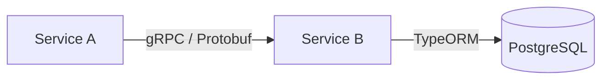
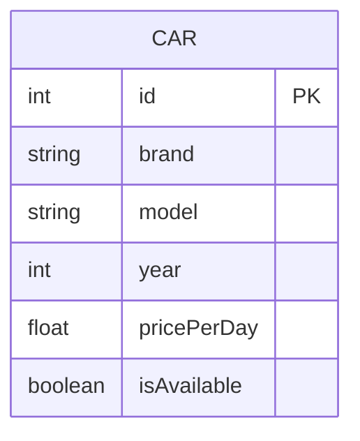

# Service B (Car Fleet)

This microservice is responsible for managing the vehicle fleet. It handles data persistence and exposes its features via gRPC.



## Features

* gRPC server (port 50051).
* Car CRUD management.
* Data persistence with TypeORM and PostgreSQL.



## Development

To start the service in development mode:

```bash
npm install
npm run start:dev
```

The service requires an accessible PostgreSQL instance to function correctly.
